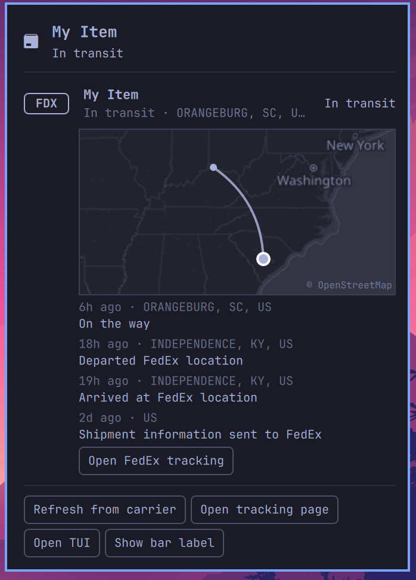
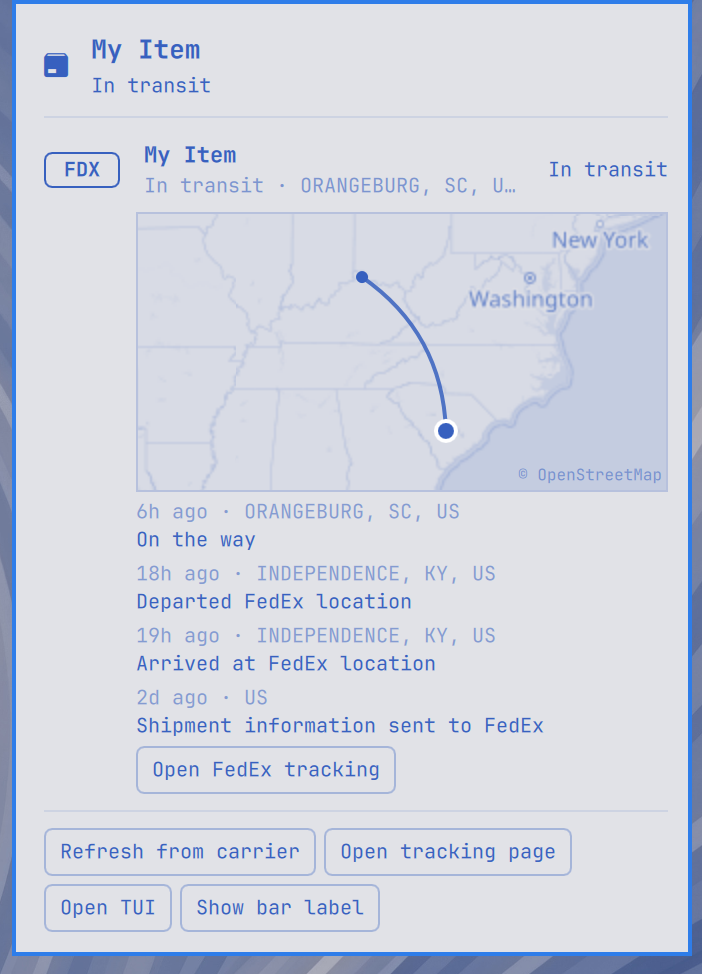
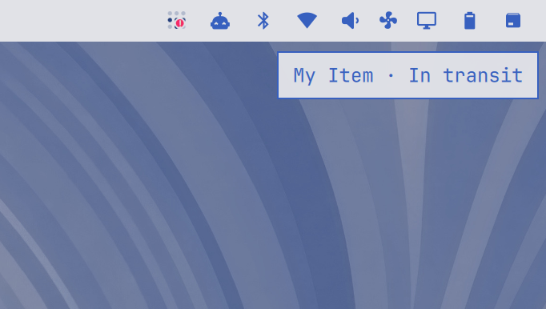

# Parcel — parcel tracking in the Omarchy bar

A bar widget for [Omarchy](https://omarchy.org/) that keeps your
shipments in the bar: a state-colored badge for the lead parcel, and a
popup with every shipment, ETAs, expandable checkpoint timelines, and a
mini-map of each parcel's route drawn in your theme's colors.



The map follows the active theme — the same popup in a light theme, and
the bar in minimal mode (status icon only, toggleable from the popup):

 

- **Badge**: lead parcel (your explicit selection, or the soonest
  arrival), colored by state — accent for out-for-delivery, urgent for
  exceptions, muted once delivered. Left-click opens the popup,
  right-click opens the carrier's tracking page, middle-click refreshes
  from the carrier.
- **Popup**: every shipment with carrier chip, latest status, and ETA.
  Expanding a row shows its checkpoint timeline and a route map — stops
  connected by arcs, current position highlighted, OpenStreetMap tiles
  recolored to match the active theme (light or dark, automatically).
- **Theme-native**: every color comes from the live Omarchy theme;
  switching themes restyles the badge, popup, and map on the spot.

## Requirements

The widget is a front-end for the
[parceltracker](https://github.com/kayleg/parceltracker-rs) CLI, which
owns the parcel list and talks to the tracking APIs. Omarchy's plugin
installer never runs code, so the CLI is not installed automatically —
if it is missing, the popup offers an **Install CLI** button that runs
the build in a floating terminal (needs the Rust toolchain), or install
it yourself:

```bash
cargo install --git https://github.com/kayleg/parceltracker-rs
```

Amazon (TBA…) parcels track out of the box with no API key; other
carriers (FedEx, UPS, USPS, DHL, …) need a 17track API key — run
`parceltracker setup` for a guided walkthrough.

The route map uses `curl` (geocoding and map tiles, cached under
`~/.cache/parceltracker/map`) and `imagemagick` (theme recoloring), both
present on a stock Omarchy install. Map data © OpenStreetMap
contributors, geocoding by Nominatim.

## Install

```bash
omarchy plugin add https://github.com/kayleg/omarchy-parcel.git --enable
```

Then add parcels:

```bash
parceltracker add <tracking-number> "New keyboard"
```

## Settings

| Setting | Default | Effect |
|---------|---------|--------|
| `refreshIntervalSec` | 60 | How often the widget re-reads local state |
| `showLabel` | true | Lead parcel name + ETA next to the bar icon |
| `showMap` | true | Route mini-map in expanded parcel rows |
| `themedMap` | true | Recolor map tiles to the theme (off = standard OSM colors) |

## Development

Model logic is pure JavaScript shared with a node test suite:

```bash
node tests/model.test.js
```

Developed in the
[parceltracker-rs](https://github.com/kayleg/parceltracker-rs) repo
(`omarchy-plugin/` directory); this repo is the installable plugin
split from it.

## License

MIT
